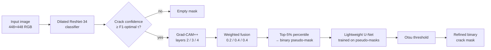

# Weakly-Supervised Semantic Segmentation of Cracks

Pixel-accurate crack masks from image-level labels only — a two-stage Grad-CAM++ → U-Net pipeline.

[](https://www.python.org/)
[](https://pytorch.org/)
[](https://opencv.org/)
[](https://scikit-learn.org/)
[](https://docs.astral.sh/uv/)
[](https://developer.nvidia.com/cuda-toolkit)
[](LICENSE)

Pixel-level crack masks are expensive to label, but cheap to *miss* — a single mislabeled hairline ruins a training batch. This project trains a crack segmenter using only image-level `crack` / `no-crack` labels by mining Grad-CAM++ attention from a dilated ResNet-34 and using the resulting pseudo-masks to supervise a lightweight U-Net that snaps to the actual crack edges.

## 📊 Dataset

- **[Crack Segmentation Dataset](https://www.kaggle.com/datasets/lakshaymiddha/crack-segmentation-dataset)** on Kaggle — RGB images of cracked and uncracked concrete surfaces, with pixel-level ground-truth masks.
- Only image-level labels (`crack` / `no-crack`, derived from filenames) are used during training.
- Pixel-level masks are reserved for final test-set evaluation only.

## 🧠 Architecture

**Full technical write-up with ablations:** [project-overview.pdf](project-overview.pdf)



### 1. Classification with attention — dilated ResNet-34

Standard ResNet-34 collapses a $448 \times 448$ input to a $7 \times 7$ feature map by layer 4. At that resolution Grad-CAM++ produces blob-sized attention that smears thin crack geometry beyond recovery.

Layers 3 and 4 are patched in place: stride drops from $2$ to $1$, dilation goes to $d=2$ and $d=4$ respectively, padding adjusts to match. Feature maps stay at $28 \times 28$ throughout the deep layers, with the same effective receptive field as the unmodified backbone.

The classifier is pretrained on ImageNet and fine-tuned for binary `crack` / `no-crack` with a class-balanced `WeightedRandomSampler`.

### 2. Multi-scale Grad-CAM++ → pseudo-masks

Grad-CAM++ pixel-weighted coefficients $\alpha$ are derived from second- and third-order gradients of the crack-class score and applied to feature activations from layers 2, 3, and 4 (all $28 \times 28$ after the dilation patch). The three maps are fused with weights $0.2 / 0.4 / 0.4$ — layer 2 contributes edge detail, layers 3 and 4 contribute semantic context.

Two filters convert the fused map into a binary pseudo-mask:

- **Confidence gate.** If the classifier's crack probability is below the F1-optimised threshold, the pseudo-mask is empty and the expensive Grad-CAM++ pass is skipped — saves compute and prevents low-quality maps from contaminating U-Net training.
- **Percentile binarisation.** Only the top 5% most activated pixels (95th percentile) are marked as crack. Conservative on purpose: the U-Net's job is to *expand* a clean seed, not denoise a messy one.

### 3. Segmentation refinement — lightweight U-Net

A 4-stage U-Net (32 → 64 → 128 → 256 channels with symmetric skip-connections) is trained on `(image, pseudo-mask)` pairs with binary cross-entropy. The RGB input grounds the model in real edge structure while the pseudo-mask provides the (noisy) supervision target.

This is the step that turns blurry CAM blobs into thin, continuous masks: the network learns to *snap* coarse attention to actual crack boundaries visible in the image. At inference, the classifier acts as a gate — low-confidence images skip the U-Net entirely and return an empty mask.

### 4. Adaptive binarisation — Otsu

The U-Net output is a $[0, 1]$ probability map. Rather than fixing a threshold, Otsu's method is fit on ~1000 training-set predictions to pick the value that maximises between-class variance, keeping the threshold data-adaptive across runs without manual tuning.

## 📈 Results

| Configuration | Mean IoU | Mean Dice | Precision | Recall |
|---|---|---|---|---|
| **Full pipeline** (ResNet-34 + Grad-CAM++ + U-Net) | **0.3064** | **0.4015** | 0.2952 | 0.3607 |
| Ablation — no U-Net (CAM → Otsu directly) | 0.2163 | 0.2835 | 0.0936 | 0.7624 |

Both rows report single-epoch training runs; metrics are reproducible from the committed `classifier_best.pth` / `segmentation_best.pth`. The U-Net refinement trades raw recall for substantially higher precision and ~0.12 better Dice — exactly what's expected from a learned post-processor over conservative pseudo-labels.

## 📁 Project Structure

```
crack-detection/
├── src/
│   ├── config.py              # Single CONFIG dict — hyperparameters, paths, flags
│   ├── datasets.py            # ImageDataset, stratified split, WeightedRandomSampler
│   ├── models.py              # Dilated ResNet-34 + Grad-CAM++, lightweight U-Net, pseudo-label generation
│   ├── train.py               # Two-stage training entrypoint (classifier → pseudo-labels → U-Net)
│   ├── threshold_selection.py # F1-optimal confidence threshold + Otsu segmentation threshold
│   ├── test.py                # Inference + IoU / Dice / precision-recall + RLE submission
│   ├── utils.py               # Transforms, oversampler, mask metrics, mask2rle
│   ├── visualize.py           # Worst / median / best prediction grid by Dice
│   └── setup.py               # Kaggle dataset download
├── classifier_best.pth        # Trained dilated ResNet-34 weights
├── segmentation_best.pth      # Trained U-Net weights
├── submission.csv             # Final test-set predictions in RLE format
├── project-overview.pdf       # Full technical write-up with ablations
└── pyproject.toml             # uv-managed dependencies (CUDA 11.8 / 12.8 selectable)
```

## 🚀 Setup

### Prerequisites

- [uv](https://docs.astral.sh/uv/getting-started/installation/)
- NVIDIA GPU + drivers (CUDA 11.8 by default; flip the `[tool.uv.sources]` block in `pyproject.toml` to use 12.8)
- A Kaggle API token at `~/.kaggle/kaggle.json` for the dataset download step

### Quick start

```bash
git clone https://github.com/jakubradziejewski/crack-detection.git
cd crack-detection
uv sync
uv run src/setup.py     # downloads the Kaggle dataset into ./data/
uv run src/train.py     # trains classifier → mines pseudo-labels → trains U-Net → evaluates
```

A full report (training metrics, threshold search, ablations) prints at the end of `train.py`, and `visualization_stratified.png` is written with three worst / three median / three best predictions ranked by Dice.

## 🏛️ Key Architecture Decisions

- **Dilation over plain ResNet-34.** Stride-2 layers collapse features to $7 \times 7$, yielding unusable Grad-CAM++ attention for thin geometry. Patching layers 3 and 4 to stride-1 + dilation $2/4$ keeps deep features at $28 \times 28$ with the same receptive field, at the cost of more FLOPs per forward pass.
- **Multi-scale CAM fusion (0.2 / 0.4 / 0.4).** Layer 4 alone misses fine edges; layer 2 alone is too noisy. Fixed weights bias toward semantic layers while letting the shallow layer contribute geometry.
- **F1-optimised confidence gate before pseudo-label generation.** The threshold is chosen automatically by maximising F1 on the validation set, not hand-picked. Below-threshold images get an empty pseudo-mask rather than a poor CAM — this keeps noise out of U-Net training.
- **U-Net as a learned post-processor, not a from-scratch segmenter.** The pseudo-masks are intentionally conservative (top 5%). The U-Net's job is to extend them along true edges using the RGB image as evidence, not to learn segmentation from scratch.
- **Otsu over a fixed segmentation threshold.** Output probability distributions shift between runs; Otsu picks the foreground/background split adaptively from ~1000 training predictions.
- **Single `CONFIG` dict.** All hyperparameters, paths, and feature flags live in [src/config.py](src/config.py), so runs are reproducible from one source of truth.

## 📚 References

- *Grad-CAM++: Improved Visual Explanations for Deep Convolutional Networks* — Chattopadhyay, Sarkar, Howlader, Balasubramanian (2018). [arXiv:1710.11063](https://arxiv.org/abs/1710.11063)
- *U-Net: Convolutional Networks for Biomedical Image Segmentation* — Ronneberger, Fischer, Brox (2015). [arXiv:1505.04597](https://arxiv.org/abs/1505.04597)
- *DeepLab: Semantic Image Segmentation with Deep Convolutional Nets, Atrous Convolution, and Fully Connected CRFs* — Chen, Papandreou, Kokkinos, Murphy, Yuille (2017). [arXiv:1606.00915](https://arxiv.org/abs/1606.00915)

## 📝 License

MIT — see [LICENSE](LICENSE).
